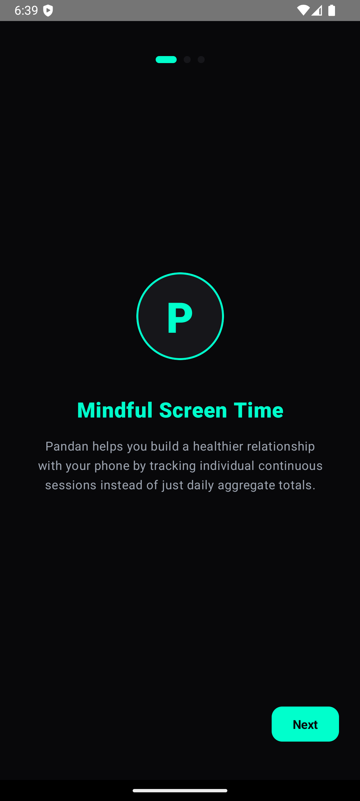
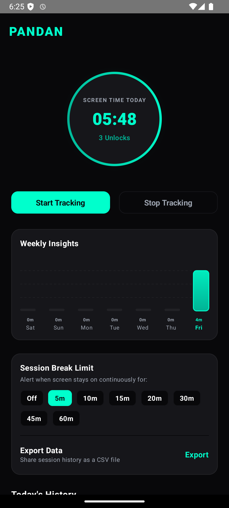
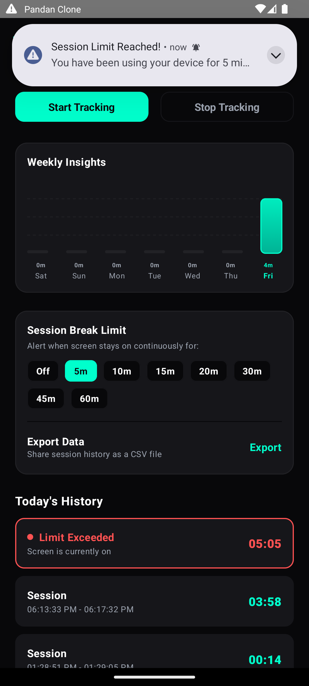

# Pandan (Android Screen Timer)

Pandan is a lightweight, mindful screen-time tracking application for Android, inspired by the "Pandan" utility on macOS. 

Unlike standard digital wellbeing apps that focus on daily cumulative limits, Pandan focuses on **session-based tracking**. It displays exactly how long your screen has been continuously active in real-time to help prevent mindless scroll cycles. When your screen turns off, the session is logged, and the timer starts fresh once the screen is turned back on.

---

## Screenshots

  
  
  

---

## Core Features

- 🕒 **Real-Time Status Bar Timer**: A low-power background service shows a ticking chronometer (`MM:SS`) in your notification shade, detailing exactly how long your current session has been active.
- 🔊 **Synthesized Software Chime Alerts**: Set a continuous session limit (e.g. 10m, 20m, 30m). When exceeded, the app triggers a high-priority alert playing a custom-synthesized digital chime sound and vibrating.
- 📊 **Weekly Insights Canvas Chart**: A custom bar chart drawn directly via Jetpack Compose `Canvas`. Shows gradient bars of daily screen time totals for the past 7 days, highlighting today's bar.
- 🔑 **Unlock Counter**: Displays the exact number of times you have unlocked/turned on your device screen today.
- 💾 **Local Persistence**: Saves all sessions to a local, secure SQLite database using Room.
- 📤 **CSV Session Export**: Compile your entire session logs into a clean CSV format and export/share it securely using the native Android Share Sheet.
- 🌙 **Premium Obsidian Dark Theme**: A gorgeous, battery-saving pure dark theme (`#08080A`) with vibrant Neon Mint (`#00FFCC`) and Teal highlights.

---

## Setup & Installation

### Prerequisites
- **Android Studio** (Koala or newer recommended)
- **Android SDK 34** (compileSdk/targetSdk)
- A physical Android device or Emulator running **Android 8.0 (API 26) or newer**

### Instructions
1. Clone or download this project.
2. Open **Android Studio** and select **Open An Existing Project**.
3. Choose the `/PandanClone` folder.
4. Let Gradle sync and download dependencies.
5. Connect your device (make sure **USB Debugging** is enabled in Developer Options).
6. Press the green **Run** button at the top of the toolbar.

---

## How it Works Under the Hood
1. **Foreground Service**: Runs a persistent service (`ScreenTimerService`) to avoid Android OS power management termination.
2. **Dynamic Broadcast Receivers**: Listens to system broadcasts `ACTION_SCREEN_ON` and `ACTION_SCREEN_OFF`.
3. **Session Processing**: When the screen turns off, it calculates `System.currentTimeMillis() - startTime` and commits it asynchronously to the database.
4. **Alarms & Delayed Jobs**: Schedules lightweight coroutine jobs that wait for the user's selected limit and fire high-importance notification alerts upon expiry.
